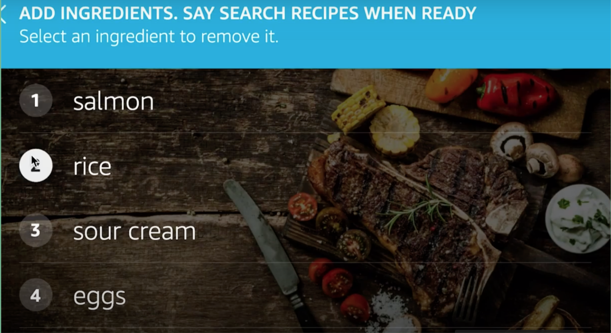
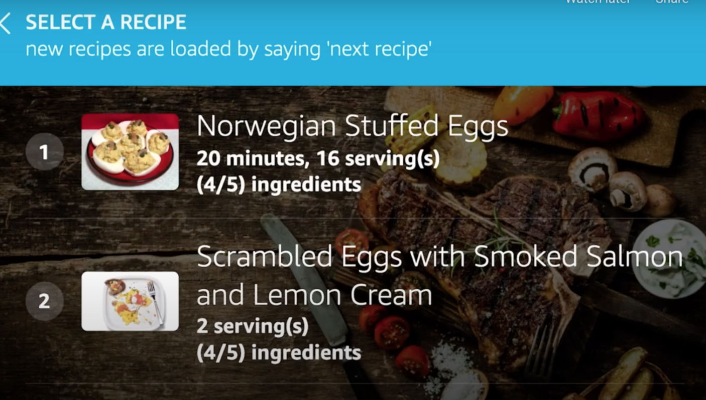
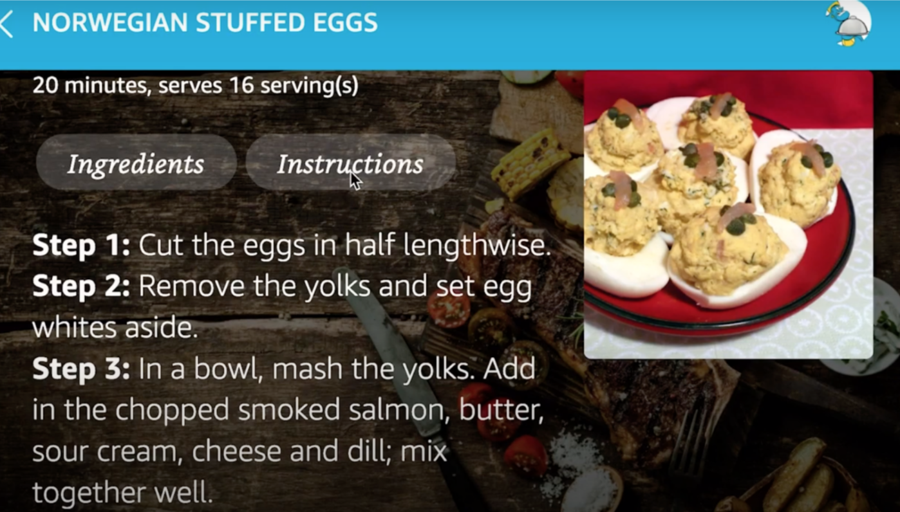
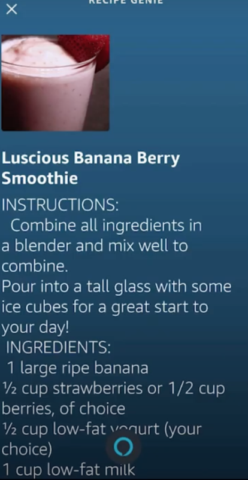

# What it does
Recipe Genie is Amazon Alexa skill powered by voice and visuals that will find food or drink recipes that use the ingredients you have in your kitchen while using as many of your ingredients as possible. This way, you can combine your ingredients into a delicious recipe, and avoid throwing away leftover ingredients.
# Devpost Submission
As part of my DevPost submission for the Amazon Alexa Beyond Voice hackathon, I incoporated APL (Amazon Presentation Language) so that recipe genie would have a visual display for alexa devices with screens. Check out the links below for the submission and a video demo!
* [Devpost submission](https://devpost.com/software/recipe-genie) 
* [Video demo](https://www.youtube.com/watch?v=NRfQhhLTsBw)

## Things you can do 
* If you want to find a specific dish or drink, you can specify that by saying "only show omelet", for example, which will find recipes including that keyword in the title. This can also be combined with ingredients in your search.

* After adding ingredients, you can search for recipes, and select a recipe from the options.

* Once you select a recipe, you can hear the ingredients, then step-by-step instructions, or send the recipe to your phone.

* Recipe Genie is also flexible so that you can go back and add more ingredients, remove ingredients and search again, or select a different recipe - even if you're at a further stage in the process.

>If you have an Alexa device with a screen, you will see your ingredients pop up on your screen, recipes found for your search, and be able to view your selected recipe along with its' ingredients and step by step instructions.

# Recipe Genie In Action
### Adding Ingredients
.
### Selecting a Recipe
.
### Instructions for a recipe
.
### Recipe sent to phone

